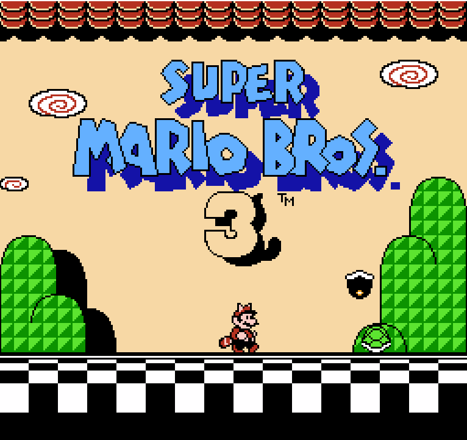
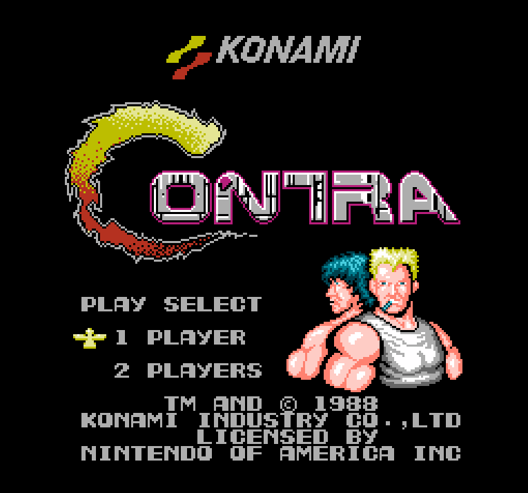

# Nes模拟器

## 简介
采用C++编写的一款FC模拟器

## 截图

  

## 依赖
> 1. glfw3
> 2. glad
> 3. SDL2

## 使用方法
> nes \<rom-path\>

## 控制方法
|功能|按键|
|:-:|:-:|
|Start|Enter|
|Select|S|
|A|Z|
|B|X|

## 已知问题
* `APU` 和 `PPU` 的模拟不完美